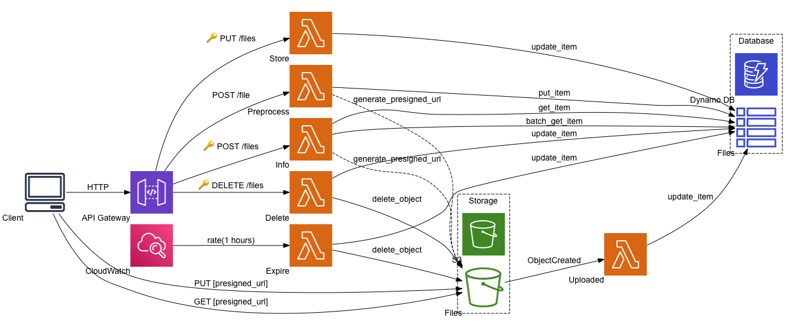

# Filestore [Serverless App]

A cloud file storage API backed by S3 and a sample client based on [FilePond](https://pqina.nl/filepond/).

* AWS: API Gateway, Lambda, DynamoDB, S3, CloudWatch
* SAM + Swagger (OpenAPI)
* Python 3.7
* REST API, Security: API KEY
* FilePond client



## Prerequisites

* AWS Account
* AWS CLI
* SAM CLI
* Python 3.7
* (Optional) jq

## Deployment

1. Create S3 bucket for deployment

    ```BUCKET NAME``` is where the deployment artefacts are placed

    ```REGION``` is where your bucket is created
    
        aws s3api create-bucket --bucket [BUCKET NAME] --create-bucket-configuration LocationConstraint=[REGION]
    
1. Upload Swagger (OpenAPI) file

        aws s3 cp swagger.yaml s3://[BUCKET NAME]/

1. Build the project with SAM

        sam build --template template.yaml --build-dir ./dist

1. Package the project with SAM

        sam package --s3-bucket [BUCKET NAME] --template-file dist/template.yaml --output-template-file dist/packaged.yaml

1. Deploy the project with CloudFormation

        aws cloudformation deploy --template-file dist/packaged.yaml\
            --stack-name FilestoreAppStack --s3-bucket [BUCKET NAME] --capabilities CAPABILITY_NAMED_IAM\
            --parameter-overrides "StorageBucketName=filestore-project"\
                "SwaggerLocation=s3://[BUCKET NAME]/swagger.yaml"

    Additional deployment parameters
    
    * ```EnvironmentParameter=dev|prod``` - deployment environment (String)
    
    * ```SignedUrlExpiration=3600``` - signed URL-s (S3) expiration in seconds (Number)
        
    * ```StoreOnLoad=False|True``` - mode of operation for storing files after upload (String)

        True = files are immediately stored after upload.
        
        False = files are temporarily stored after upload, use the "store" API to store them permanently

1. Get the output from the deployment

        aws cloudformation describe-stacks --stack-name FilestoreAppStack | jq .Stacks[0].Outputs

    This command uses ```jq``` to extract the outputs from the JSON reponse.

1. Create an API key for authentication

    Use a recognisable ```API KEY NAME```

        aws apigateway create-api-key --enabled --name [API KEY NAME]

1. Add the key to the usage plan

    ```PLAN ID``` can be found in the deployment output, look for the object with ```"OutputKey": "UsagePlanId"```

    ```API KEY ID``` look for the ```"id"``` value in the reponse from creating the API key

        aws apigateway create-usage-plan-key --key-type "API_KEY" --usage-plan-id [PLAN ID] --key-id [API KEY ID]

## Test

1. Run unit test

    1. Need to adjust ```PYTHONPATH``` to include the source directory holding the function implementations.

            export PYTHONPATH=$PYTHONPATH:"`pwd`/source"

    1. Run the test (there is only one for now)

            python -m unittest tests.unit.file

1. Run integration tests

    1. Install pytest and tavern
        
            pip install pytest tavern
        
    1. Set environment variables
        
            export TEST_HOST="..."
            export TEST_API_KEY="..."
            
        ```TEST_HOST```: Retrive the host from the CloudFormation output at the end of deployment.

        ```TEST_API_KEY```: Use the API key created during deployment. 
    
    1. Run the integration tests one by one
        
            tavern-ci tests/integration/test_upload_file.tavern.yaml
            tavern-ci tests/integration/test_store_file.tavern.yaml
            tavern-ci tests/integration/test_delete_file.tavern.yaml
            tavern-ci tests/integration/test_download_file.tavern.yaml

## Remove Deployment

Remove the deployment (deleting stack) if the app is not needed anymore, or if something goes wrong during deployment that needs fixing before trying it again.

        aws cloudformation delete-stack --stack-name FilestoreAppStack

## Web app client

There is an example web app client you can deploy for testing purposes.

1. Create S3 bucket for the static site

    ```WEB BUCKET NAME``` is the bucket where the the static site is deployed
    
    ```REGION``` is where your bucket is created
    
        aws s3api create-bucket --bucket [WEB BUCKET NAME] --create-bucket-configuration LocationConstraint=[REGION]
        
    Note the response will include your S3 static website link, something like http://[WEB BUCKET NAME].s3.amazonaws.com/

1. Update the S3 bucket policy to allow public acces

        aws s3api put-bucket-policy --bucket [WEB BUCKET NAME]\
            --policy '{"Version": "2012-10-17", "Statement": [{ "Sid": "Allow Public Access to All Objects", "Effect": "Allow", "Principal": "*", "Action": "s3:GetObject", "Resource": "arn:aws:s3:::[WEB BUCKET NAME]/*"}]}'

1. Update S3 bucket website hosting configuration

        aws s3api put-bucket-website --bucket [WEB BUCKET NAME] --website-configuration '{"IndexDocument": {"Suffix": "index.html"},"ErrorDocument": {"Key": "error.html"},"RoutingRules": [{"Redirect": {"ReplaceKeyWith": "index.html"},"Condition": {"KeyPrefixEquals": "/"}}]}'       

1. Update the Filestore app URL
    
    Open the ```static/web/index.html``` file and replace the ```[YOUR_URL]/[YOUR ENVIRONMENT]``` at the bottom with the Filestore app URL, which is the ```ApiRootUrl``` from the CloudFormation output.

    Use the environment from the deployment configuration, or use ```dev``` if you kept the default.

    The final URL will look like: https://xxxxxxxxx.execute-api.xxxxxx.amazonaws.com/dev

1. Upload static files

        aws s3 cp static/web s3://[WEB BUCKET NAME] --recursive --acl public-read
 
1. Open the website at http://[WEB BUCKET NAME].s3.amazonaws.com/index.html

## User Guide

Find more details about the use of the API in the [User Guide](user_guide.md).
